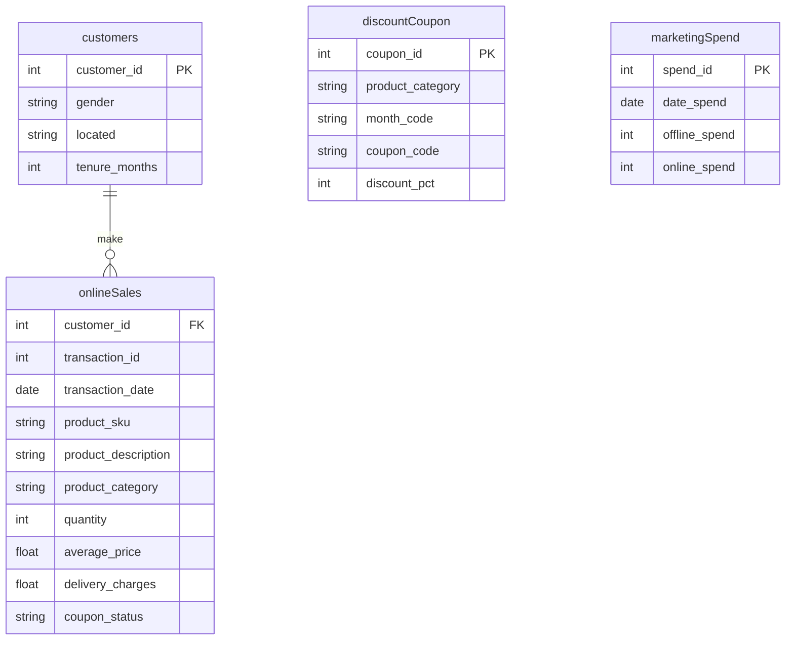

# ETL and dbt Modeling for Marketing Analytics 

The implementation is maintained in two distinct GitHub repositories, 
each responsible for a separate component of the data pipeline. 

| Repository | Component |
| --- | --- |
| acme-etl-dwh-mktg | ETL pipeline |
| acme-etl-dwh-mktg | dbt modeling |

The first repository contains the ETL pipeline, which extracts and loads data into a BigQuery data warehouse. 

The second repository houses the dbt project, which performs data modeling and transformation on the data stored in the warehouse.

## 1. Scenario and Purpose

An e-commerce company is expecting analysis from their online transactions data. 

Business Requirements: 

1. **Customer segmentation**
   The segmentation helps to understand customers profile and defining 
   cross sell/upsell strategies, for example.  
   RFM segmentation is based on Recency, Frequency and Monetary values. 
   Recency is the number of days since a customer made the last purchase. 
   Frequency is the number of purchases in a given period. 
   Monetary is the total amount of money a custome spent in a given period.
   Customers are divided into Premium, Gold, Silver or Standard categories.  

2. **Exploratory Analysis**
   Understanding how the discounts playing role in the revenues.
   Understanding how marketing spend is impacting on revenue.  

3. **Cross selling**
   Additionally, it can be analyzed what items can be bundled togheter. 

## 2. Architecture overview

* Ingestion layer: data collection  
* Processing layer: data preparation for analysis
* Consumption layer: query on data warehouse

### Ingestion layer

This layer is responsible for collecting and importing data from various sources into the system.

1. **Current Implementation**
   An OLTP database is simulated through a MySQL dockerized. Samples of datasets are
   loaded into MySQL.  
   A simple ETL pipeline as a single Python module is responsible to extract, prepare 
   data for loading, and load into BigQuery warehouse. 

### Processing layer

This layer transforms the raw data loaded into the target dataset on BigQuery.  

1. **Current Implementation**
   dbt cloud is responsible to transform the data and build the required models
   to compose the star schema.    

### Consumption layer

This layer enables exploration and analysis of processed data through dbt queries.

1. **Planned Implementation**
   Analysis of data in BigQuery will be performed by running SQL queries against the
   start schema data model. 

## 3. Project Structure

### High level view


## 4. Tools

* **a) Python (Data Extract & Load)**
    * Custom-built module (data extraction and loading)
* **b) dbt cloud (Data Transformation)**
    * SQL models
    * seeds
    * User-defined Generic and Custom tests
* **c) Big Query (Data Warehouse)**
* **e) Other**
    * Star Schema (dimensional data modeling)
    * `.env` files (Configuration as Code)
    * `README.md` files (documentation)
    * `requirements.txt` (package management)

## 6. Project Methodology & Technical Details

### Data Extraction and Load

The data pipeline uses the ETL framework, extracting and loading data with from MySQL into an BigQuery data warehouse. 
Only a small transformation is applied: dates are converted to string to prevent conflict with 
the pandas-gbq library.    

Data is extracted from four csv samples containing synthetic data:

1. **customers.csv:**
   This file contains customer’s demographics.
   CustomerID: Customer Unique ID
   Gender: Gender of customer
   Location: Location of Customer
   Tenure_Months: Tenure in Months

2. **discountCoupon.csv:**
   Discount coupons have been given for different categories in different months. 
   Month: Discount coupon applied in that month
   Product_Category: Product category
   Coupon_Code: Coupon Code for given Category and given month
   Discount_pct: Discount Percentage for given coupon

3. **marketingSpend.csv:**
   Marketing spend on both offline & online channels on day wise. 
   Date: Date
   Offline_Spend: Marketing spend on offline channels
   Online_Spend: Marketing spend on online channels

4. **discountCoupon.csv:**
   This file contains actual orders data (point of Sales data) at transaction level 
   with below variables. 
   CustomerID: Customer unique ID
   Transaction_ID: Transaction Unique ID
   Transaction_Date: Date of Transaction
   Product_SKU: SKU ID – Unique Id for product
   Product_Description: Product Description
   Product_Cateogry: Product Category
   Quantity: Number of items ordered
   Avg_Price: Price per one quantity
   Delivery_Charges: Charges for delivery
   Coupon_Status: Any discount coupon applied


### Data Extraction and Load
Transformation is provided on dbt cloud by creating SQL models in two layers:

1. **Staging:**
   This is an intermediate storage layer for further data transformations.  
   The main concept is to have one staging model for each source table.
   Each dbt model is responsible to extract data from the orginal source 
   table and stage it in separate CTEs.
   A yaml file serves as configuration for the staging models, by specifying
   execution order and dependencies.       

2. **Marts:**
   At the marts layer  
   
   
   In a stage environment, Airflow manage the orchestration. Kafka producing
   and consuming manage data on S3 storage. 

Unit tests using `unittest` ensure function correctness. Airflow DAGs orchestrate script execution. 

### Naming Conventions

| Convention | Description | Field Type |
| --- | --- | --- |
| `stg` | Staging tables or CTE | Table/CTE |
| `dim` | Dimension tables | Table |
| `fct` | Fact tables | Table |
| `nk` | Natural keys | Column |
| `sk` | Surrogate keys | Column |
| `mtr` | Metric columns (numeric values) | Column |
| `dt` | Description columns (text values) | Column |
| `dt` | Date and time columns | Column |

## 7. Future Direction

* Test implementation.
* Documentation (yml file configuration with documentation).
* Go-live process: create production envinroment and job. 
* Further analysis on the live warehouse.

## 8. Miscellaneous

### ERD diagram 



### Project Structure

```bash
├── docker-compose.yml                 # Docker launch with MySQL and ETL 
├── gbq.env                            # Envinronment definition for BigQuery
├── load_db.env                        # Envinronment definition for load to MySQL
├── mysql.env                          # Envinronment definition for handling MySQL
├── .gitignore
├── README.md
├── app-data                           # Data samples
│   ├── customers.csv
│   ├── discountCoupon.csv
│   ├── marketingSpend.csv
│   └── onlineSales.csv   
├── app-etl-gbq                        # Extract from MySQl and load to GBQ
│   ├── Dockerfile
│   ├── etl_gbq.py
│   └── requirements.txt   
├── app-load-db                        # Loading samples to MySQL db
│   ├── Dockerfile
│   ├── load_db.py
│   └── requirements.txt   
├── app-mysql                          # MySQL instance and setup db DDL
│   ├── Dockerfile
│   └── setup_db.sql   
                          
```